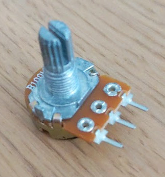

# Pot Socket

A tiny PCB for allowing potentiometers with horizontal pins to be mounted
vertically on a larger PCB. It relies on [3 Pin 2.54mm 90 Degree Locking
Headers](https://www.jaycar.com.au/3-pin-0-1in-90-degree-locking-header-2-54mm-pitch-single/p/HM3423)
connected to J1.

Here's the 90 degree header.

Snap off the plastic locking tab to allow the other end to be soldered to the
main PCB.

Here's the style of potentiometer this circuit is designed for:

Pairs of adjacent pins on the potentiometer are 5mm apart.
